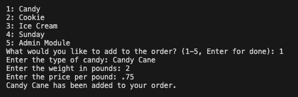
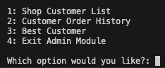
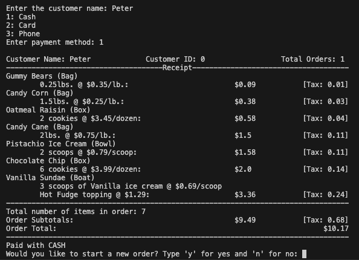

# Dessert Shop

This is a point of sale program written in python and using ojbect oriented programming principles.

The program is run from the terminal. There are options to add various desserts to an order. When the customer has completed their order they checkout by submitting their name and payment method. Then a receipt will be displayed with the full order

Image demonstrating adding to an order:

Image showing admin menu options:

Image showing checkout and final reciept:

